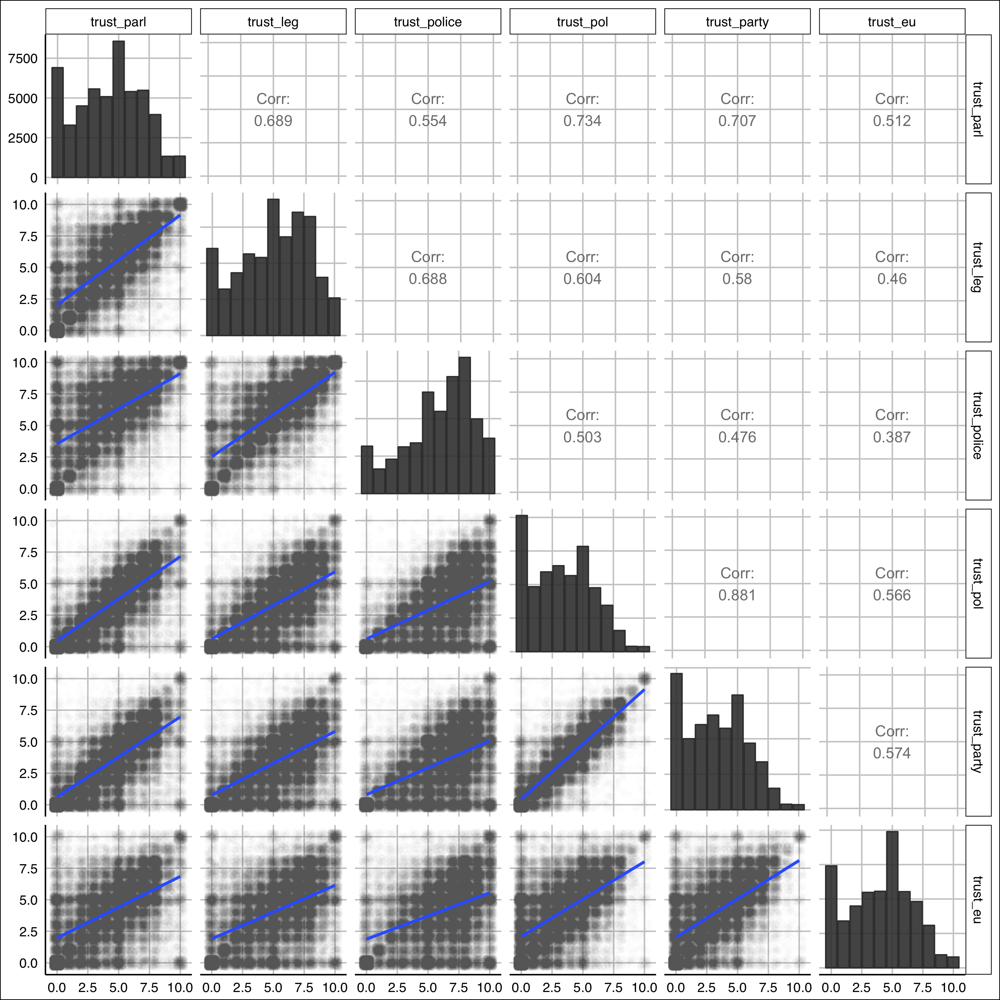

## Packages

```{r}
pacman::p_load(dplyr, ggplot2, readr, haven, broom, purrr, tidyr, magrittr, labelled, sjPlot, viridis, forcats, ggthemes, cluster, factoextra, fpc)
```

## Data

```{r}
ess <- get(load("data/Rdata/ess_final.Rdata")) %>%
  group_by(country) %>%
  mutate(id = paste0(iso2, 1:n()))
```


## Trust 

First we explore the diemnionality of the given trust items by applying standard pairwise scatterplots for euch variable combination and principal component analysis (efa) gain information on the distribution of variance in the data. After that conformatory factor analysis scores are computed for one trust dimesnion and merged for later analysis.


```{r}
trust_data_id <- ess %>%
  select(id, contains("trust")) %>%
  na.omit() 

trust_data <- trust_data_id %>% select(-id)
```

### Exploratory Analysis

```{r}
library(GGally)

trust_scatter <- function(data, mapping, ...) {
  ggplot(data = data, mapping = mapping) +
    geom_jitter(alpha = .01, color = "#3D3D3D") + 
    geom_smooth(method = "lm") +
    geom_smooth(method = "smooth", color = "red")
}

trust_hist <- function(data, mapping, ...) {
  ggplot(data = data, mapping = mapping) +
    geom_bar(fill = "#3D3D3D", alpha = .9, color = "#3D3D3D")
}

pm <- ggpairs(
  trust_data, 
  #columns = c("total_bill", "time", "tip"),
  diag = list(continuous = wrap(trust_hist)),
  lower = list(
    #combo = wrap("facethist", binwidth = 1),
    continuous = wrap(trust_scatter)
  )
) + ggthemes::theme_gdocs()

pm
#ggsave(pm, filename = "ggpairs_trust.png", width = 10, height = 10)
#ggpairs(fa_data, types = list(continuous = wrap(my_bin, binwidth = c(5, 0.5), high = "red")))
```




## PCA 

```{r}
fit_pca1 <- trust_data %>%
  scale() %>%
  prcomp()
```

```{r}
### Screeplot: Eigenvalues
fviz_eig(fit_pca1, addlabels = T, ylim = c(0, 80))

fviz_pca_var(fit_pca1, col.var = "black")

# Color by cos2 values: quality on the factor map
fviz_pca_var(
  fit_pca1, 
  col.var = "cos2",
  gradient.cols = c("#00AFBB", "#E7B800", "#FC4E07"), 
  repel = TRUE # Avoid text overlapping
)
# Graph of individuals
# fviz_pca_ind(fit_pca1)

# Total cos2 of variables on Dim.1 and Dim.2
fviz_cos2(fit_pca1, choice = "var", axes = 1:2)

# Contributions of variables to PC1
fviz_contrib(fit_pca1, choice = "var", axes = 1, top = 10)
# Contributions of variables to PC2
fviz_contrib(fit_pca1, choice = "var", axes = 2, top = 10)
# The total contribution to PC1 and PC2 is obtained with
fviz_contrib(fit_pca1, choice = "var", axes = 1:3, top = 10)
```


## Factor Analysis

```{r}
fa_trust <- trust_data %>%
  factanal(., factors = 1, scores = 'regression')

trust_data_id$trust_scores <- fa_trust$scores[,1]
trust_data_id$trust_scores %>% head
```


```{r}
dd <- trust_data_id %>% select(id, trust_scores)
ess_score <- ess %>%
  dplyr::left_join(dd)

#save(ess_score, file = "data/Rdata/ess_score.Rdata")
```


* maximum likelihood estimation
* Assumptions: Each row $x_i$ of X is an independent sample from a
multivariate normal distribution, which has the density function:

$$f(x_i) = \frac{1}{2\pi^{p/2}|\Sigma|^{1/2}}e^{-\frac{1}{2}(x_i-\mu)^T\Sigma^{-1} (x_i-\mu)}$$

In addition, the covariance matrix is modelled by a structure of common factors accounting for a joint component of variance and specific residual variances for each variable:

$$\Sigma = \Lambda\Lambda^T + D_\psi$$

Need to first: write out the likelihood, and then maximize it!!!
*Easier* to start with a one-factor solution...

$$\Sigma = \lambda\lambda^T + D_\psi$$

* The proportion of the variance in each original variable $x_d$ accounted for by the first $PC_1$ given by the sum of the squared factor loadings; that is $\sum^c_{k=1} f^2_{ik}$. When c=p (all components are retained). $$\sum^c_{k=1} f^2_{ik}=1$ (all variance is explained)

* Factor loadings are the correlations between the original variables x and the components PC, denoted as $F = cor(x, PC) = uD^{1/2}$. Internal Validation measure to see the correlation between predictors and extracted components.


### Factor Rotations

The factor loadings matrix is usually rotated or re-oriented in order to receive uncorrelated factors/ components. The goal is to find clusters of variables that are highly correlated and to large extend define only one factor. 

* **Orthogonal rotation:** preserves the perpendicularity of the axes (remain uncorrelated)
    + **Varimax**: preserves simple structure by focusing on the columns of the factor loadings matrix. The Kaiser`s varimax rotation aims to maximize the independent squared loadings variance across variables summed over all factors.
    + **Quartimax** rotation - preserves simple structure by focusing on the rows of the factor loading matrix
* **Oblique rotation - allows for correlation between the rotated factors. The purpose is to align th efactor axes as closely as possible to the groups of the original variables. The goal is to facilitate the interpretation of the results (more distrimative).
  * **Promax rotation**


Common factor model - observed variance in each measure is attributable to a relatively small number of common factors and a single speficif factor (uncorrelated to other factors in the model). 

my opinion 

$$x_{i1} = \lambda_1\xi_{i1} + \lambda_2\xi_{i2} + ... + \delta_i  $$

her opinion:

$$x_{i} = \lambda_{i1}\xi_1 + \lambda_{i2}\xi_2 + ... + \delta_i  $$


The common analysis is appropriate when there is a *latent trait* or unobservable characteristics. Used within suervey questions about attitudes. The goal is to identify common factors captering the variance from these questions and which can also be used as factor scores.

* Assumptions to determine a solution to the common factor model:
    + The common factors are uncorrelated with each other
    + The specific factors are uncorrelated with each other.
    + The common factors and specific factors are uncorrelated with each other. 
    
* The communality is the proportion of variance in X attributable to the common factors

$$h_i^2 = \sum_k \lambda^2_{ik} = 1- \theta_{ik}^2$$
where $\theta_{ik}^2 = var(\delta_i)$ is the fcator uniqueness. 
* The solution to the common factor model is determined by orienting the first factor so that it captures the greatest possible varinace but is uncorrelated with the first factor.
* The correlation between X variables and the ... factors are called loadings $\Lambda$.
* The factor scores present the psoitions of the observations in the common factor space. The factpr score coefficients are given by 

$$B = R^{-1}\Lambda_c$$

where R is the correlation matrix
* The factor scores are calculated as:

$$\Xi = X_SB$$
These factor scores are included in the data and can be used instead of the original variables. 


```{r, eval = F}
library(ggplot2)
library(survival)
data(lung, package = "survival")
summary(ess$rel)
ess_surv <- ess
ess_surv$year <- 2017 - ess_surv$year 
sf.ess <- survival::survfit(Surv(year, gndr) ~ 1, data = ess_surv)
ggsurv(sf.ess)
```

