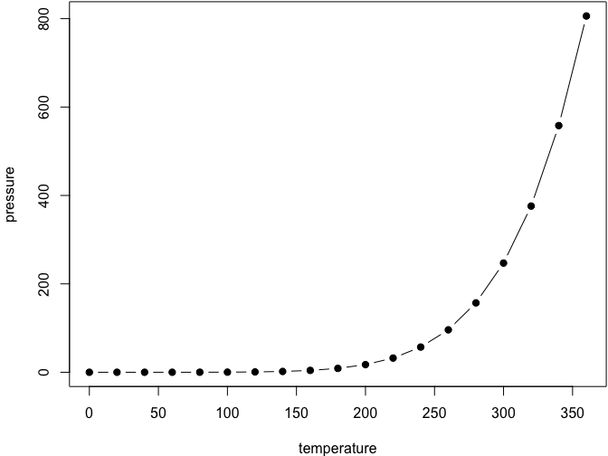

ESS Voting Anlysis
================
Rebecca & Simon

Start
=====

Hi, this is Becci's and Simon\`s working page for writing the last semester paper on democratic participation. The main purpose is to perform different statistical methods in order to gain insights to the populist voting profiles. The broader question that drives this analysis is **who is attracted to give her/his vote to a populist and especially a right-wing party?** Different causal paths will be proposed and rigorously be tested by evidence from ESS and CHES data. Another aspect will be visualizing country-wise effects and model performance to get a better understanding of a model's fitting to the national context.

ToDo
----

-   Save Cluster/ PCA
-   VDEM Daten mergen
-   Probing

-   Why not using diff of leftright and party left-right
-   Why not use interaction variable of vote\_right and protest as y?
-   Is there a reasonable party\_id/ voting\_id coverage?
-   Derive final research question
-   fitting models
-   write semester paper:
    -   Die Studierenden führen für 12 LP abschließend eine eigene Untersuchung durch zu **zwei oder mehr selbst gewählten Beteiligungs- bzw. Entscheidungsprozessen**, um eine konkrete Forschungsfrage zu beantworten (ca. 30 Seiten). Wieviele Seiten zu Zweit?
-   <http://students.brown.edu/seeing-theory/basic-probability/index.html#section2>

Research Question(s)
--------------------

-   internal and external political efficacy -&gt; likelihood to vote right/populist or green party? Cultural clash.
-   Are citizens who live in systems that provide extensive direct democratic decision-making processes characterized by higher levels of trust in political institutions and higher external political efficacy?
-   ESS in combination with direct democracy dataset?
-   Macro predictors: political system or number of referendum
-   Multilevel-Bayesian Regression.

EDA
---

-   Check selective or pairwise compare correlations (stepwiseAIC or multilevel prediction tree).
-   spatial mapping
-   Factor scores (Factor Analysis)
    -   Trust (target)
    -   Imm (X)

Statistical Modeling
--------------------

### Multilevel

-   Y = voting right wing/populist
-   X\_1 = ex\_eff (trust factor scores) + in\_eff
-   X\_2 = immigration(factor scores)
-   X\_3 = s\_gov + s\_dem + interaction + demo + sign\_pet
-   X\_4 = poli\_intr + lrscale + party\_act + news\_pol
-   X\_5 = gndr + edu + income + rel + year
-   X\_6 = social\_lazy (social benefit attitudes)
-   What about Z predictors?

### Prection Power

-   multilevel tree
-   `brms`
-   viele random slopes

You can label chapter and section titles using `{#label}` after them, e.g., we can reference Chapter @ref(intro). If you do not manually label them, there will be automatic labels anyway, e.g., Chapter @ref(methods).

Figures and tables with captions will be placed in `figure` and `table` environments, respectively.

``` r
par(mar = c(4, 4, .1, .1))
plot(pressure, type = 'b', pch = 19)
```


<p class="caption">
Here is a nice figure!
</p>

Reference a figure by its code chunk label with the `fig:` prefix, e.g., see Figure @ref(fig:nice-fig). Similarly, you can reference tables generated from `knitr::kable()`, e.g., see Table @ref(tab:nice-tab).

``` r
knitr::kable(
  head(iris, 20), caption = 'Here is a nice table!',
  booktabs = TRUE
)
```

|  Sepal.Length|  Sepal.Width|  Petal.Length|  Petal.Width| Species |
|-------------:|------------:|-------------:|------------:|:--------|
|           5.1|          3.5|           1.4|          0.2| setosa  |
|           4.9|          3.0|           1.4|          0.2| setosa  |
|           4.7|          3.2|           1.3|          0.2| setosa  |
|           4.6|          3.1|           1.5|          0.2| setosa  |
|           5.0|          3.6|           1.4|          0.2| setosa  |
|           5.4|          3.9|           1.7|          0.4| setosa  |
|           4.6|          3.4|           1.4|          0.3| setosa  |
|           5.0|          3.4|           1.5|          0.2| setosa  |
|           4.4|          2.9|           1.4|          0.2| setosa  |
|           4.9|          3.1|           1.5|          0.1| setosa  |
|           5.4|          3.7|           1.5|          0.2| setosa  |
|           4.8|          3.4|           1.6|          0.2| setosa  |
|           4.8|          3.0|           1.4|          0.1| setosa  |
|           4.3|          3.0|           1.1|          0.1| setosa  |
|           5.8|          4.0|           1.2|          0.2| setosa  |
|           5.7|          4.4|           1.5|          0.4| setosa  |
|           5.4|          3.9|           1.3|          0.4| setosa  |
|           5.1|          3.5|           1.4|          0.3| setosa  |
|           5.7|          3.8|           1.7|          0.3| setosa  |
|           5.1|          3.8|           1.5|          0.3| setosa  |
