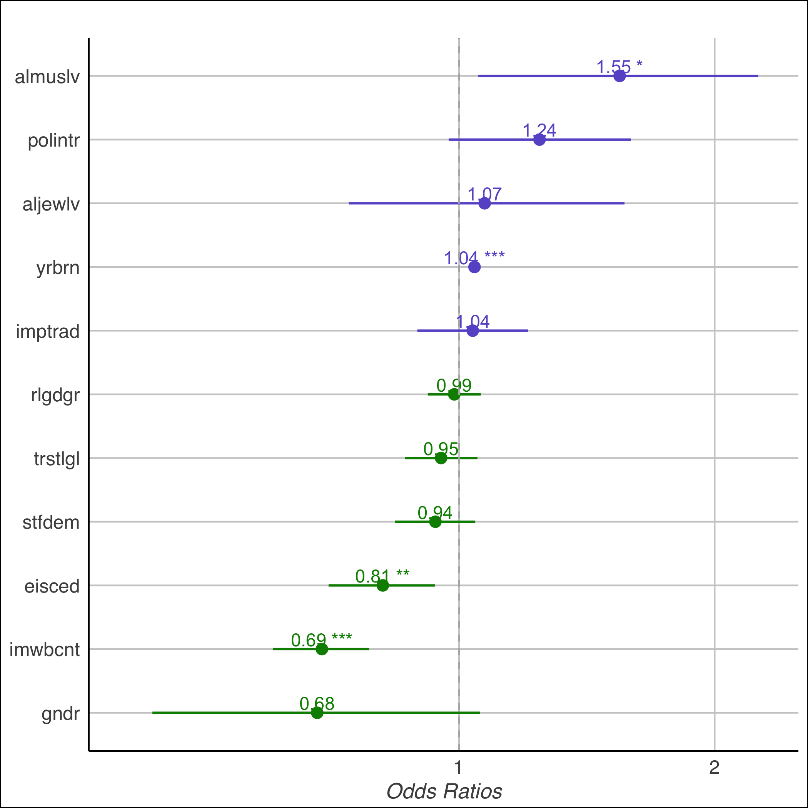
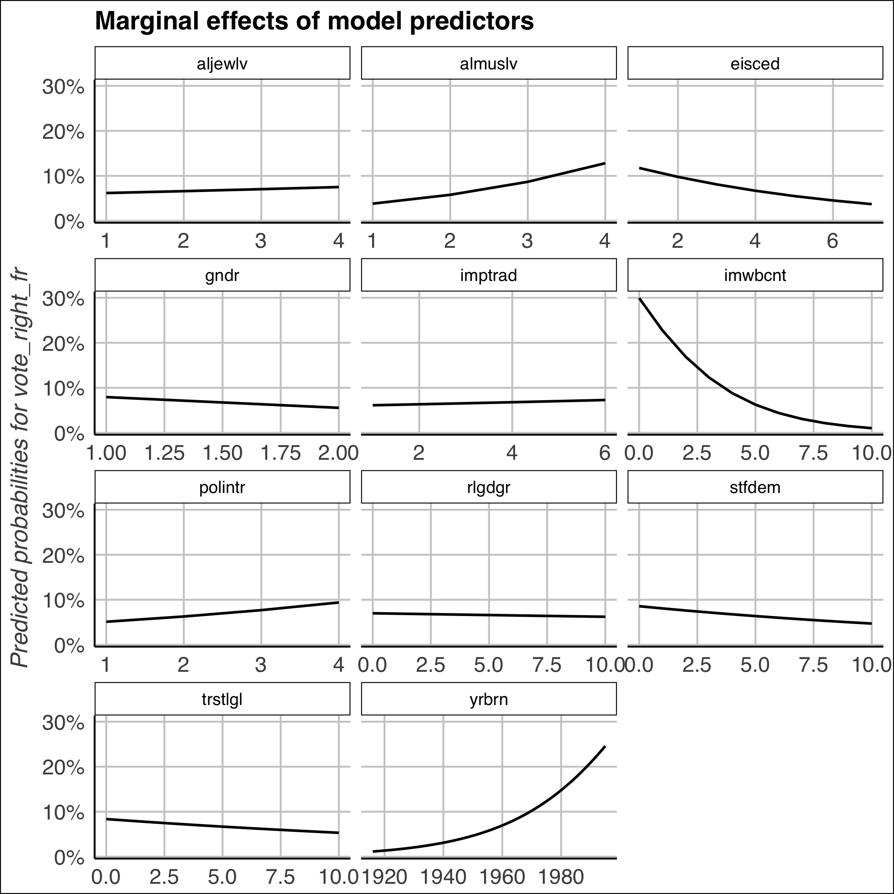
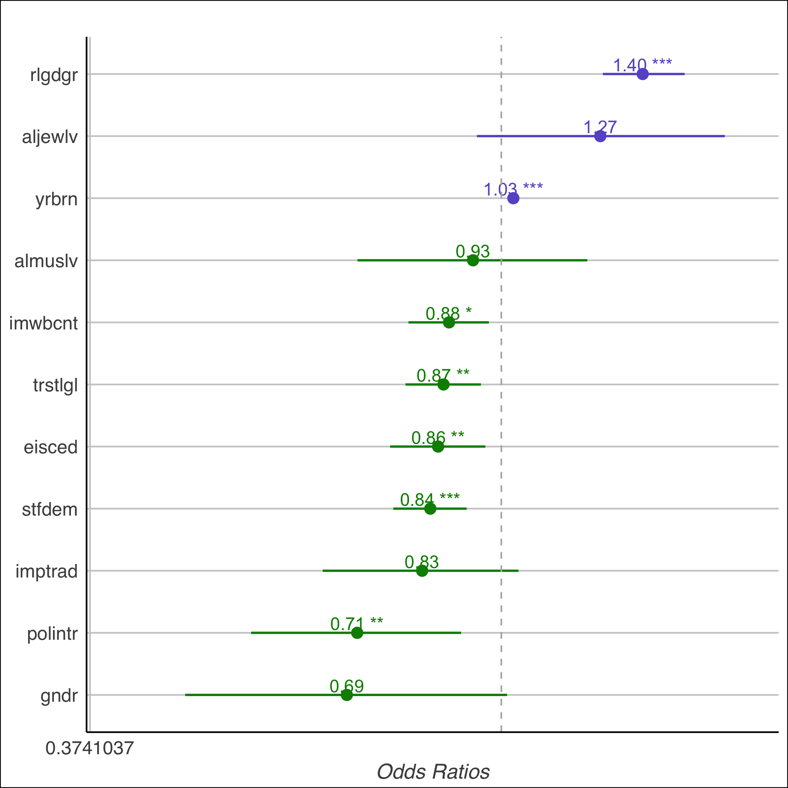
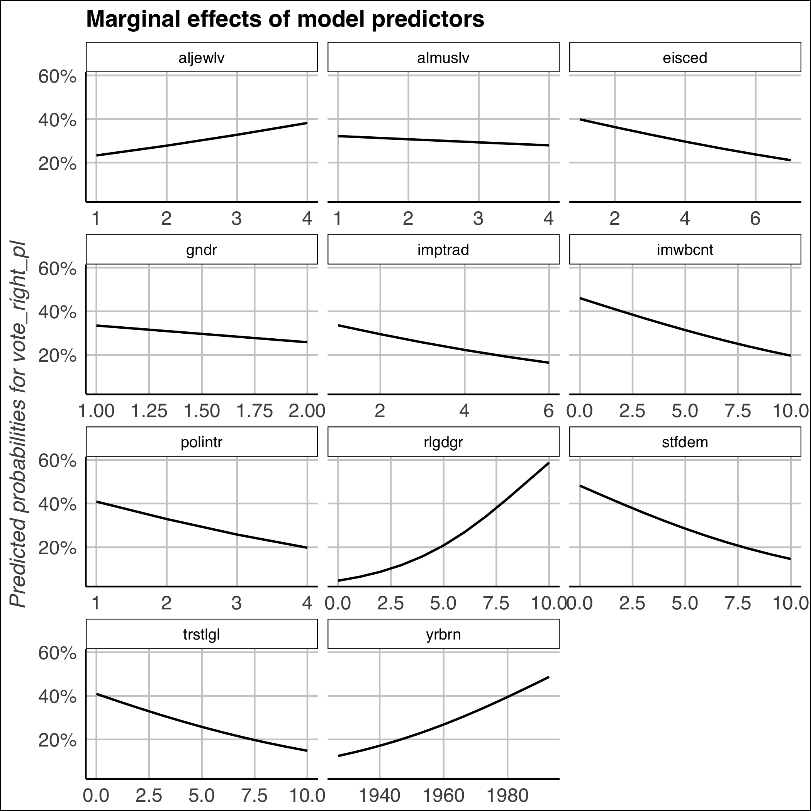

```{r setup3, include=FALSE, eval = F}
### Knitr settings
knitr::opts_chunk$set(echo = F,
                      eval = T,
                      message = F,
                      warning = F,
                      error = F, 
                      #fig.height = 3.5, 
                      #fig.width = 5, 
                      fig.align = "center")
```


# Methods

## Data
The data used for the following review of the hypotheses are based on the data set of the European Social Survey [@ess2014]. The European Social Survey (ESS) is a multi-country scientific survey conducted every 2 years since 2002 by scientists in european countries. The objectives of the ESS are to understand the changing attitudes and values in Europe, to explain how european institutions are changing and to develop a range of european social indicators and values [@ess2014]. In addition, academically sound data collection and evaluation should improve the quality of social science analyzes. The data for the present analysis were collected in the seventh round of the survey in 2014 in 22 countries. These were recorded with the help of personal interviews. In order to test the above-named hypotheses, a sub-sample will be prepared from the data set which only considers the answers of respondents from France and Poland who voted during the last election. This leads to 1,056 - 1,010 respondents in France (depending on the dimensions and the proportion of mission values) and 658 - 778 respondents in Poland that are included in the statistical calculation of the model.

## Dependent Variable
For the hypotheses to be tested, the variables need to be explained. As the data set is only differentiating between the various political parties but not if they are populist or not, a new binary variable has to be developed. Therefore the existing political parties need to be analysed by its degree of nationalist populism. 

In \textbf{Poland} "the message sent by the PiS is that they are anti-communist, euro-skeptic and have a law-and-order appeal" [@jasiewicz2004knocking 500]. They are known to be a traditional right-wing populist party. In the ESS they are named the Law and Order-Party. Additionally to the PiS, the "Congress of the New Right" is also considered to be a right-wing populist party. These two parties are summed up and a new dependent variable (vote_right_pl) is created. 

The right-wing populist party in \textbf{France} is called the Front National (FN). This party is known to take France out of the Euro, the shared European currency, and restore the Franc. An exit from the European Union could follow, if they were elected [@cohen2017]. The "sense of dispossession, of loss, is what the National Front has exploited: loss of identity, jobs, national borders; loss of faith in a corrupt political system.” [@cohen2017 3]. In the case of France the new dependent variable (vote_right_pl) is created with one party, the FN.   


## Independent Variable

In order to build the statistical models, the six hypotheses are operationalized. The indicators for the hypotheses are following:


\begin{itemize}


\item \textbf{For H1:} The gender of a person (1 =female, 0= male).

\item \textbf{For H2:} The indicator for age is the year of birth which will be displayed in the results. 

\item \textbf{For H3:} The indicator for education is the variable "Highest level of education" in the ESS. In this case 1 = less than lower secondary and 7 = higher tertiary education > MA level. This means that the variable is increasing with its levels of education. 

\item \textbf{For H4:} The political dimension of the theory is operationalized with the variables "satisfaction with democracy" (1 = extremely dissatisfied, 10 = extremely satisfied ), "political interest" (1 = very interested, 4 = not at all interested) and "trust in the legal system"(1 =no trust, 10= complete trust). 

\item \textbf{For H5:} The xenophobic dimension is measured with 3 different variables: "Immigrants make country worse or better place to live" ( 0 = make it worse to live, 10 = make it better to live), "Allow many or few Muslims to come and live in country" and "Allow many or few Jewish people to come and live in country", (both 1= allow many, 4 = allow none). 

\item \textbf{For H6:} The last hypotheses' indicators are "Important to follow traditions and customs" ( 1= very much, 6= not important) and "How religious are you" (0= not at all, 10 = very religious).  

\end{itemize}

<!-- The household income (measured in euros), gender (1 = female, 0 = male) and identification with the host country are also included in the statistical models. These indicators are control variables that are also relevant for these integration analyzes.  -->
The logistic regression analysis verifies if they are mathematically related to a higher probability to vote for right-wing populist parties. 


## Logistic regression

"Logit regression are nonlinear regression models specifically designed for binary dependent variables" [@stock2007introduction 389]. Because a regression with a binary outcome Y (dependent variable) models the probability that Y=1, one needs to adopt a nonlinear formulation that forces the predicted values to be between 0 and 1 [@stock2007introduction]. It allows one to say that the presence of a predictor increases (or decreases) the probability of a given outcome by a specific percentage. This paper analysis the two possible outcomes. 

$$
y_i = \left\{
\begin{array}{l}
1:\text{ if voted for a populist party}\\
0:\text{ if not}
\end{array}\right.
$$

Logistic regression belongs to the generalized linear models (GLM). These have the special characteristics that we model the probability p(X) by using a function that transforms the outputs to range of 0 and 1 for all values of X. Many functions meet this Criterion. In logistic regression, we use the logistic function, which is defined as follows [@stock2007introduction]:


$$
\begin{array}{l}
z_i = \beta_0+ \beta_1 X_i + \varepsilon_i\\
p(X) = \frac{e^{z_i}}{1 + e^{z_i}}\\
p(X) = \frac{1}{1 + e^{-z_i}}\\
\end{array}
$$

This monotone transformation is called the log odds or logit transformation of $p(X)$. The non-linear transformation delivers Odds which can be interpreted.

$$
\frac{p(X)}{1+p(X)} =  \beta_0+ \beta_1 X \\
$$

### Coefficients

"The Logit coefficients are best interpreted by computing predicted probabilities and differences in the probabilities. [...].The coefficient of the logit model can be estimated by maximum likelihood" [@stock2007introduction 594]. Logit coefficients can be directly interpreted with respect to the direction of their effect and whether they have a significant effect. We distinguish between two cases: A positive logit coefficient indicates that a regressor increases the probability of Y = 1, a negative logit coefficient indicates that a regressor reduces the probability of Y = 1. 

<!-- The algorithm used for GLM is maximum likelihood. First we estimate parameters for $\beta_0$ and $\beta_1$ such that the predicted probability is the lowest error rate according to the empricial observations. This procedure yields a number close to one for all individuals who voted for right wing populists, and a number close to zero for all individuals who did not. This intuition can be formalized using a mathematical equation called a likelihood function: -->

<!-- $$\ell ( \beta_0, \beta) = \prod_{i:y_i=1} p(x_i) \times \prod_{i:y_i=1} (1-p(x_i))$$ -->


<!-- This likelihood gives the joint probability of the observed sequence of zeros and ones in the data. We pick $\beta_0$ and $\beta_1$ to maximize the likelihood of the observed data. -->


### Odds Ratio

The Odds Ratio can be interpreted as followed: If the independent variable (X) increases in one unit, the ratio will either be smaller than 1 or bigger. We can therefore predict two directions, the Odds Ratio will forecast for the dependent variable "vote for a Right-Wing Populist Party": 

$$
Odds Ratio  = \left\{
\begin{array}{l}
< 1: \text{the probability to vote for a Right-Wing Populist party decreases  }\\
> 1: \text {the probability to vote for a Right-Wing Populist party increases }
\end{array}\right.
$$


### Marginal Effects Plot
The Marginal Effects Plot shows the predicted probabilities for the dependent variable "voted for a right-wing populist party". On the x-axis, we can again see the increase of the independent variable, on the Y-axis, the in- or decrease of probability to vote for a right-wing populist party (the dependent variable) can be observed. 

# Results and Analysis
In order to test the outlined hypotheses a sequential regression approach is conducted. That means that three models are estimated per country with increasing complexity. The first model comprises only 3, the second 6 and the full model 11 predictors. This way parameter stability and model fit can be evaluated. As the full models for both countries have the lowest negative likelihood and therefore perform best only these models are reported in the following. 

## France


{width="60%"}

\newpage

{width="60%"}


From the Odds-Ratio Dot Plot for the French model, different patterns can be observed:The variables that have a negative effect on voting for right-wing populists (highlighted in green) are gender= female, welcoming immigrants and a high level of education. The variables that have a positive effect on voting for Right Wing Populists (highlighted in purple) are Age (the later born, the higher the possibility to vote right) and Islamophobia. With the help of the Odds Ratio graph the five most important variables that lead to voting for right-wing populism could be discovered. The Marginal Effect Plot will give a more detailed explanation of these five variable.

Five important conclusions can be made from the following two graphs (Odds Ratio and Marginal Effects): \textbf{Gender:} An increase from male respondent to female respondent decreases the probability to vote for a right-wing populist party with the factor 0.68 to 1. There is a small decrease in the probability that the respondent is female and voting the FN. \textbf{Xenophobia:} A decrease in xenophobia in one unit decreases the probability to vote for  a right-wing populist party with factor 0.69 : 1. Respondents who are xenophobic have a 30\% higher predicted probability to vote the FN than people who are not xenophobic at all. This effect is significant. \textbf{Education:} An increase in education decreases the probability to vote for a right-wing populist party with factor 0.84 to 1. People with high education (= 6) have a 5\% probability to vote for the FN, respondents that have a lower level of education (< 3) have higher chance to vote for FN. This effect shows an approximately 6\% higher probability to vote the FN if the level of education is low. \textbf{Islamophobia:} An increase in islamophobia increases the probability to vote for a right-wing populist party with factor 1.55 : 1. If the respondent does not accept Muslims at all, a strong increase in predicted probabilities to vote for the FN can be observed. Starting with a probability that is close to zero (0\%), the  probability to vote FN increases by more than 10\% with increasing islamophobia. We can conclude: Islamophobic people in France vote the FN. \textbf{Age:} An increase in the year of birth increases the probability to vote for a right-wing populist party with factor 1.04 : 1. Young people (yrbrn = 1980 and higher) have 20-30\% higher predicted probability to vote for FN than older respondents. This is a strong increase of probability to vote FN with decreasing age.


Additionally, it is important to highlight, that not all variables have a significant effect in France. These are the variables that are very close to the boarder of 1. In the case of France, we can observe that traditions, religiousness, trust in the legal system, political interest, Anti-Semitism and satisfaction with democracy do not contribute to explain why people vote right-wing populist parties.


## Poland
 
{width="60%"}

{width="60%"}


The Odds-Ratio Dot Plot for the polish model indicates different conclusions. The variables that have a negative effect on voting for right-wing populists (highlighted in green) are gender= female, a high political interest, the perception that traditions are not important, more satisfaction with democracy, trust in the legal system and a high level of education. The variables that have a positive effect on voting for Right Wing Populists (highlighted in purple) are Age (the later born, the higher the possibility to vote right) and Religiousness. 
With the help of the Odds Ratio graph the five most important variables that lead to voting for right-wing populism could be discovered. The Marginal Effect Plot will give a more detailed explanation of these five variables.  

Five important conclusions can be made from these graphes: \textbf{Gender:} an increase from male respondent to female respondent decreases the probability to vote for a right-wing populist party with the factor 0.69 to 1. A 10\% decrease of predicted probability to vote right-wing populist party can be observed if respondent is female. \textbf{Satisfaction with Democracy:} An increase of one unit from dissatisfaction with democratic system to satisfaction decreases the probability to vote for a right-wing populist party with factor 0.84: 1. The Marginal Effects graph shows that respondents who are extremely dissatisfied have a 40\% predicted probability to vote for right-wing populist party. Satisfied respondents have a lower (20\%) chance to vote for right-wing populist party. \textbf{Religiousness:} An increase in religiousness  increases the probability to vote for right-wing populist party with factor 1.49 : 1. This is a 50\% increases of the probability to vote for a right-wing populist party. This Marginal Effect graph shows the strongest effect: Respondents who are very religious have a 60\% predicted probability to vote for right-wing populist party. Respondents who do not consider themselves as religious have a 0\% predicted probability to vote a right-wing populist party. \textbf{Xenophobia:} A decrease in xenophobia in one unit decreases the probability to vote for right-wing populist party with factor 0.88:1. A xenophobic respondent has over 40\% predicted probability to vote for right-wing populist party.  This is a very strong effect. \textbf{Age:} An increase in the year of birth increases the probability to vote for nationalist party with factor 1.03 : 1. Young people (yrbrn = 1980 and higher) have a 20-30\% higher predicted probability to vote for right-wing populist party than older people. 


To complete the analysis, it is again important to find the variables that do not have a significant effect in Poland. In the case of Poland, we can observe that Islamophobia and Anti-Semitism do not play an important role when one has to interpret the variables that lead to voting right-wing populist parties. 


## Comparison

Comparing the results from polish and french dimensions that lead to voting right wing populist parties interesting observations can be discovered: 

\textbf{Hypotheses 1} could be confirmed: In both countries Women have a lower probability to vote for right-wing populist parties. Additionally \textbf{Hypotheses 2}, concerning the age could partially be confirmed: The assumption that young people are more vulnerable for Populism is proofed with this research. Yet the assumption that older people are also more interested in populist parties had to be rejected for both countries.  \textbf{Hypotheses 3} could be approved in both cases: \textbf{Education} is a significant factor that leads to less acceptance of populist parties. In the case of \textbf{Hypotheses 4}, it had to be rejected for France: in this case none of the three indicators "dissatisfaction with democracy", "less trust in the legal system" nor "less political interest" lead to a voting behavior favoring the Front National. These variables are simply non significant in all three cases. This is the complete opposite for polish electorate: All three indicators lead to a higher probability to voting right-wing populist parties in Poland. An interesting result is found for \textbf{Hypotheses 5}: xenophobic and islamophobic values lead to a high probability to vote right-wing populists in France, in the polish case neither islamophobia nor xenophobia have a significant effect on voting right-wing populists. Anti-Semitism does not seem to have any importance in both cases. In contrast to this, \textbf{Hypotheses 6} shows that traditional and religious values are not significant for french voters. The polish electorate however has the strongest probability in religion as an indicator for voting right-wing populist parties. 


# Conclusion

As this comparative study has showed, the reasons of supporting right-wing populist parties are very various. In a secular state like France, where traditions and religion do not play an important role in politics, these social values do not lead to being populist. In Poland, a strict conservative and catholic country that values religion and tradition and where the borders between church, politics and governments are not clearly separated the populist parties have really high success in promoting their program addressing religious values. 

For France, the most important indicator for right-wing populism is xenophobia, especially islamophobia. This may not be a great surprise, as Marine Le Pen's campaign was directly "targeting the Muslim population and [...] her republican and secularist stance was little more than a facade" [@aurelien2013mainstreaming 91-92].
This observation could not be shared in Poland. Nevertheless, we have to consider that the data set was produced in 2014, 2 years before the immigration-situation in Europe changed and xenophobic values may also have "spilled over" to Poland. This could be tested with more current data in the future.

The results of this research show the possibility of combating right-wing populism with information campaigns against racism and xenophobia. It could also be considered to strengthen the welfare state for countries having problems with right-wing populism. As the paper shows, high education is a very good instrument against populism. If education was free (and not controlled by churches) the chances are higher that the population feels included in society and no one left alone. The feeling of "dispossession and loss" could be tackled that way.

Additionally, current political parties could consider new ways of including the population in political processes in order to prevent the formation of images of an "elite" that is too far away from reality. Political processes could be made more accessible through local political forums that give the impression of inclusiveness. 

All in all, this research showed the great variety of possibilities for populists to win electorate through direct campaigns but also potential solutions to get control of populist politics. 


\newpage 

# Appendix {-}

<!-- Der Titel muss im notebook geändert werden -->
\input{images/tab1.tex}
\input{images/tab21.tex}
\input{images/tab22.tex}
\input{images/reg_final.tex}

\newpage

# Declaration {-}

I hereby declare that I have written the present thesis independently and without any inadmissible aids. All text passages that were used are duly cited and marked.

\vspace{2cm}

Heidelberg, 11/13/2017
