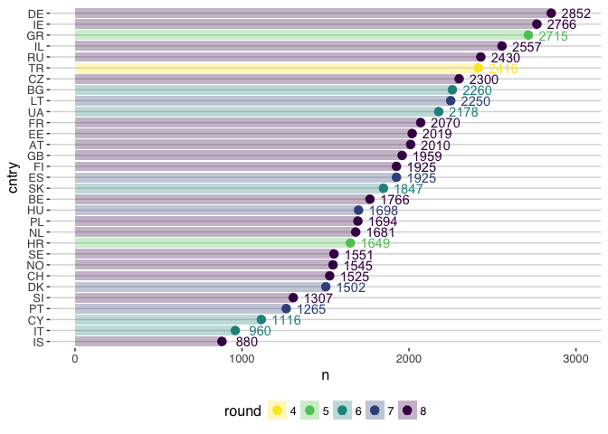
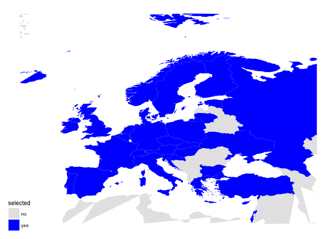

ESS
================
Rebecca & Simon

ToDo
----

-   Build github Repo (Name?) -&gt; social data science journey.
-   Derive research question
-   data wrangling
-   fitting models
-   write semester paper:
    -   Die Studierenden führen für 12 LP abschließend eine eigene Untersuchung durch zu **zwei oder mehr selbst gewählten Beteiligungs- bzw. Entscheidungsprozessen**, um eine konkrete Forschungsfrage zu beantworten (ca. 30 Seiten). Wieviele Seiten zu Zweit?
-   <http://students.brown.edu/seeing-theory/basic-probability/index.html#section2>

Research Question(s)
--------------------

-   internal and external political efficacy -&gt; likelihood to vote right/populist or green party? Cultural clash.
-   Are citizens who live in systems that provide extensive direct democratic decision-making processes characterized by higher levels of trust in political institutions and higher external political efficacy?
-   ESS in combination with direct democracy dataset?
-   Macro predictors: polticial system or number of referenda
-   Multilevel-Baysian Regression.

Packages
--------

``` r
pacman::p_load(dplyr, ggplot2, readr, haven, broom, purrr, tidyr, magrittr, labelled, sjPlot, viridis, forcats, ggthemes)
```

Data
----

``` r
ess <- read_sav("data/ESS8e01.sav")
ess_add <- read_sav("data/ESS1-7e01.sav") %>%
  filter(! cntry == "RU" & !cntry == 6)
# unique(ess$cntry) %in% unique(ess_add$cntry)
```

Select Variables from ESS round 8 and the cummulative round 1-7 for missing country data ([ESS Long Format](http://www.europeansocialsurvey.org/downloadwizard/)). The countries are augumented from:

-   `Round 6`: Ukraine, Slovakia, Hugary, Cyprus, Bulgaria, Albania
-   `Round 5`: Turkey, Kosovo, Italy, Greece, Croatia
-   `Round 7`: Spain, Protugal, Lithuania, Denmark

``` r
tx_clean_spss <- function(x){
  x %>%     
    mutate_if(is.numeric, as.numeric) %>%
    mutate_if(is.character, as.character) %>%
    mutate_if(is.factor, as.factor)
}

get_party <- function(x){
  x %>% 
    select(contains("prtvt")) %>%
    mutate_all(sjmisc::to_label) %>% 
    mutate_all(as.character) %>%
    mutate(vote = apply(., 1, function(x) paste(ifelse(is.na(x), "", x), collapse = "")))
}

select_both <- function(x){
  x %>%
    select(idno, cntry, essround, hinctnta, polintr, lrscale,
         rlgatnd, pbldmn, ctzcntr, rlgatnd, edulvlb, eduyrs, yrbrn, gndr,
         dplyr::starts_with("trst"),
         dplyr::starts_with("stf"),
         #dplyr::starts_with("im"),
         imbgeco, imsmetn, imdfetn, impcntr,
         #dplyr::starts_with("prtvt")
    ) %>%
    mutate(cname = sjmisc::to_label(cntry)) %>% 
    mutate(cname = countrycode::countrycode(cname, "country.name", "country.name")) %>%
    mutate(iso2 = countrycode::countrycode(cname, "country.name", "iso2c")) %>%
    mutate(iso3 = countrycode::countrycode(cname, "country.name", "iso3c")) %>%
    rename(
      id = idno, 
      round = essround, 
      income = hinctnta,
      pol_inter = polintr,
      gndr = gndr,
      year = yrbrn,
      edu_year = eduyrs,
      edu = edulvlb,
      rel = rlgatnd,
      demo = pbldmn,
      citz = ctzcntr,
      trust_parl = trstprl, 
      trust_pol = trstplt,
      trust_party = trstprt,
      trust_leg = trstlgl,
      trust_police = trstplc,
      trust_eu = trstep,
      s_life = stflife,
      s_econ = stfeco,
      s_gov = stfgov,
      s_dem = stfdem,
      imm_econ = imbgeco,
      imm_same = imsmetn,
      imm_diff = imdfetn,
      imm_poor = impcntr
    )
}
```

``` r
# spss data frame carry additional attribute information that is redudant and errorious for further analysis. 
ess_prep <- ess %>% 
  select_both()

vote <- ess %>%
  get_party()
ess_prep$vote <- vote$vote

ess_add_prep <- ess_add %>% 
  select_both()

vote <- ess_add %>%
  get_party()
ess_add_prep$vote <- vote$vote


sh <- c("idno",  "nwspol", "etusoft", "polintr", "sppsgva", "ctrolga", "sppipla", "ptppola", "wrkprty", "sgnptit",  "pbldmn", "lrscale", "stflife",  "stfeco",  "stfgov",  "stfdem",  "stfedu", "stfhlth", "euftf", "imbgeco", "imsmetn", "imdfetn", "impcntr", "rlgatnd", "ctzcntr", "sblazy", "gndr", "yrbrn", "eduyrs", "dulvlb", "inctnta", "region")

for(jj in sh){
  print(jj)
  print(any(colnames(ess_add) %in% jj))
}
```

    ## [1] "idno"
    ## [1] TRUE
    ## [1] "nwspol"
    ## [1] FALSE
    ## [1] "etusoft"
    ## [1] FALSE
    ## [1] "polintr"
    ## [1] TRUE
    ## [1] "sppsgva"
    ## [1] FALSE
    ## [1] "ctrolga"
    ## [1] FALSE
    ## [1] "sppipla"
    ## [1] FALSE
    ## [1] "ptppola"
    ## [1] FALSE
    ## [1] "wrkprty"
    ## [1] TRUE
    ## [1] "sgnptit"
    ## [1] TRUE
    ## [1] "pbldmn"
    ## [1] TRUE
    ## [1] "lrscale"
    ## [1] TRUE
    ## [1] "stflife"
    ## [1] TRUE
    ## [1] "stfeco"
    ## [1] TRUE
    ## [1] "stfgov"
    ## [1] TRUE
    ## [1] "stfdem"
    ## [1] TRUE
    ## [1] "stfedu"
    ## [1] TRUE
    ## [1] "stfhlth"
    ## [1] TRUE
    ## [1] "euftf"
    ## [1] TRUE
    ## [1] "imbgeco"
    ## [1] TRUE
    ## [1] "imsmetn"
    ## [1] TRUE
    ## [1] "imdfetn"
    ## [1] TRUE
    ## [1] "impcntr"
    ## [1] TRUE
    ## [1] "rlgatnd"
    ## [1] TRUE
    ## [1] "ctzcntr"
    ## [1] TRUE
    ## [1] "sblazy"
    ## [1] FALSE
    ## [1] "gndr"
    ## [1] TRUE
    ## [1] "yrbrn"
    ## [1] TRUE
    ## [1] "eduyrs"
    ## [1] TRUE
    ## [1] "dulvlb"
    ## [1] FALSE
    ## [1] "inctnta"
    ## [1] FALSE
    ## [1] "region"
    ## [1] FALSE

``` r
### Not included so far
# news_pol = nwspol
# inet = netusoft
# poli_intr = polintr
# have_say = psppsgva
# pol_grp = actrolga
# have_infl = psppipla
# in_eff = cptppola
# party_act = wrkprty
# sign_pet = sgnptit
# state_edu = stfedu
# sate_health = stfhlth
# eu_state = euftf
# social_lazy = sblazy
# region = regio
```

Diverging variable naming due to country time space needs special management and renaming.

``` r
# ess_prep %>% map_lgl(~any(!is.na(.)))
# select which columns do not have NA only
vote_sel <- ess_add_prep %>%
  map_lgl(~any(!is.na(.)))

ess_add_prep <- ess_add_prep %>%
  select(which(vote_sel))

# test if NA remain in vote variables
ess_add_prep %>% map_lgl(~any(!is.na(.)))
```

    ##           id        cntry        round       income    pol_inter 
    ##         TRUE         TRUE         TRUE         TRUE         TRUE 
    ##      lrscale          rel         demo         citz          edu 
    ##         TRUE         TRUE         TRUE         TRUE         TRUE 
    ##     edu_year         year         gndr   trust_parl    trust_leg 
    ##         TRUE         TRUE         TRUE         TRUE         TRUE 
    ## trust_police    trust_pol  trust_party     trust_eu       trstun 
    ##         TRUE         TRUE         TRUE         TRUE         TRUE 
    ##       s_life       s_econ        s_gov        s_dem       stfedu 
    ##         TRUE         TRUE         TRUE         TRUE         TRUE 
    ##      stfhlth        stfjb      stfjbot     imm_econ     imm_same 
    ##         TRUE         TRUE         TRUE         TRUE         TRUE 
    ##     imm_diff     imm_poor        cname         iso2         iso3 
    ##         TRUE         TRUE         TRUE         TRUE         TRUE 
    ##         vote 
    ##         TRUE

``` r
# bidn round 8 and 5-7
ess_final <- bind_rows(ess_prep, ess_add_prep) %>%
  tx_clean_spss()
```

    ## Warning in bind_rows_(x, .id): Vectorizing 'labelled' elements may not
    ## preserve their attributes

    ## Warning in bind_rows_(x, .id): Vectorizing 'labelled' elements may not
    ## preserve their attributes

    ## Warning in bind_rows_(x, .id): Vectorizing 'labelled' elements may not
    ## preserve their attributes

    ## Warning in bind_rows_(x, .id): Vectorizing 'labelled' elements may not
    ## preserve their attributes

    ## Warning in bind_rows_(x, .id): Vectorizing 'labelled' elements may not
    ## preserve their attributes

    ## Warning in bind_rows_(x, .id): Vectorizing 'labelled' elements may not
    ## preserve their attributes

    ## Warning in bind_rows_(x, .id): Vectorizing 'labelled' elements may not
    ## preserve their attributes

    ## Warning in bind_rows_(x, .id): Vectorizing 'labelled' elements may not
    ## preserve their attributes

    ## Warning in bind_rows_(x, .id): Vectorizing 'labelled' elements may not
    ## preserve their attributes

    ## Warning in bind_rows_(x, .id): Vectorizing 'labelled' elements may not
    ## preserve their attributes

    ## Warning in bind_rows_(x, .id): Vectorizing 'labelled' elements may not
    ## preserve their attributes

    ## Warning in bind_rows_(x, .id): Vectorizing 'labelled' elements may not
    ## preserve their attributes

    ## Warning in bind_rows_(x, .id): Vectorizing 'labelled' elements may not
    ## preserve their attributes

    ## Warning in bind_rows_(x, .id): Vectorizing 'labelled' elements may not
    ## preserve their attributes

    ## Warning in bind_rows_(x, .id): Vectorizing 'labelled' elements may not
    ## preserve their attributes

    ## Warning in bind_rows_(x, .id): Vectorizing 'labelled' elements may not
    ## preserve their attributes

    ## Warning in bind_rows_(x, .id): Vectorizing 'labelled' elements may not
    ## preserve their attributes

    ## Warning in bind_rows_(x, .id): Vectorizing 'labelled' elements may not
    ## preserve their attributes

    ## Warning in bind_rows_(x, .id): Vectorizing 'labelled' elements may not
    ## preserve their attributes

    ## Warning in bind_rows_(x, .id): Vectorizing 'labelled' elements may not
    ## preserve their attributes

    ## Warning in bind_rows_(x, .id): Vectorizing 'labelled' elements may not
    ## preserve their attributes

    ## Warning in bind_rows_(x, .id): Vectorizing 'labelled' elements may not
    ## preserve their attributes

    ## Warning in bind_rows_(x, .id): Vectorizing 'labelled' elements may not
    ## preserve their attributes

    ## Warning in bind_rows_(x, .id): Vectorizing 'labelled' elements may not
    ## preserve their attributes

    ## Warning in bind_rows_(x, .id): Vectorizing 'labelled' elements may not
    ## preserve their attributes

    ## Warning in bind_rows_(x, .id): Vectorizing 'labelled' elements may not
    ## preserve their attributes

    ## Warning in bind_rows_(x, .id): Vectorizing 'labelled' elements may not
    ## preserve their attributes

    ## Warning in bind_rows_(x, .id): Vectorizing 'labelled' elements may not
    ## preserve their attributes

    ## Warning in bind_rows_(x, .id): Vectorizing 'labelled' elements may not
    ## preserve their attributes

    ## Warning in bind_rows_(x, .id): Vectorizing 'labelled' elements may not
    ## preserve their attributes

    ## Warning in bind_rows_(x, .id): Vectorizing 'labelled' elements may not
    ## preserve their attributes

    ## Warning in bind_rows_(x, .id): Vectorizing 'labelled' elements may not
    ## preserve their attributes

    ## Warning in bind_rows_(x, .id): Vectorizing 'labelled' elements may not
    ## preserve their attributes

    ## Warning in bind_rows_(x, .id): Vectorizing 'labelled' elements may not
    ## preserve their attributes

    ## Warning in bind_rows_(x, .id): Vectorizing 'labelled' elements may not
    ## preserve their attributes

    ## Warning in bind_rows_(x, .id): Vectorizing 'labelled' elements may not
    ## preserve their attributes

    ## Warning in bind_rows_(x, .id): Vectorizing 'labelled' elements may not
    ## preserve their attributes

    ## Warning in bind_rows_(x, .id): Vectorizing 'labelled' elements may not
    ## preserve their attributes

    ## Warning in bind_rows_(x, .id): Vectorizing 'labelled' elements may not
    ## preserve their attributes

    ## Warning in bind_rows_(x, .id): Vectorizing 'labelled' elements may not
    ## preserve their attributes

    ## Warning in bind_rows_(x, .id): Vectorizing 'labelled' elements may not
    ## preserve their attributes

    ## Warning in bind_rows_(x, .id): Vectorizing 'labelled' elements may not
    ## preserve their attributes

    ## Warning in bind_rows_(x, .id): Vectorizing 'labelled' elements may not
    ## preserve their attributes

    ## Warning in bind_rows_(x, .id): Vectorizing 'labelled' elements may not
    ## preserve their attributes

    ## Warning in bind_rows_(x, .id): Vectorizing 'labelled' elements may not
    ## preserve their attributes

    ## Warning in bind_rows_(x, .id): Vectorizing 'labelled' elements may not
    ## preserve their attributes

    ## Warning in bind_rows_(x, .id): Vectorizing 'labelled' elements may not
    ## preserve their attributes

    ## Warning in bind_rows_(x, .id): Vectorizing 'labelled' elements may not
    ## preserve their attributes

    ## Warning in bind_rows_(x, .id): Vectorizing 'labelled' elements may not
    ## preserve their attributes

    ## Warning in bind_rows_(x, .id): Vectorizing 'labelled' elements may not
    ## preserve their attributes

    ## Warning in bind_rows_(x, .id): Vectorizing 'labelled' elements may not
    ## preserve their attributes

    ## Warning in bind_rows_(x, .id): Vectorizing 'labelled' elements may not
    ## preserve their attributes

    ## Warning in bind_rows_(x, .id): Vectorizing 'labelled' elements may not
    ## preserve their attributes

    ## Warning in bind_rows_(x, .id): Vectorizing 'labelled' elements may not
    ## preserve their attributes

    ## Warning in bind_rows_(x, .id): Vectorizing 'labelled' elements may not
    ## preserve their attributes

    ## Warning in bind_rows_(x, .id): Vectorizing 'labelled' elements may not
    ## preserve their attributes

    ## Warning in bind_rows_(x, .id): Vectorizing 'labelled' elements may not
    ## preserve their attributes

    ## Warning in bind_rows_(x, .id): Vectorizing 'labelled' elements may not
    ## preserve their attributes

    ## Warning in bind_rows_(x, .id): Vectorizing 'labelled' elements may not
    ## preserve their attributes

``` r
# rename voting columns
cols <- ess_final %>%
  select(contains("prtvt")) %>%
  colnames() %>%
  stringr::str_extract("..$") %>%
  paste0("vote_",.)

index <- which(stringr::str_detect(colnames(ess_final), "prtvt"))
colnames(ess_final)[index] <- cols

# ess_final %>%
#   group_by(cntry) %>%
#   slice(1)
# 
# ess_final %>% 
#   count(cntry, round) %>% 
#   count(cntry)
colnames(ess_final)
```

    ##  [1] "id"           "cntry"        "round"        "income"      
    ##  [5] "pol_inter"    "lrscale"      "rel"          "demo"        
    ##  [9] "citz"         "edu"          "edu_year"     "year"        
    ## [13] "gndr"         "trust_parl"   "trust_leg"    "trust_police"
    ## [17] "trust_pol"    "trust_party"  "trust_eu"     "trstun"      
    ## [21] "s_life"       "s_econ"       "s_gov"        "s_dem"       
    ## [25] "stfedu"       "stfhlth"      "imm_econ"     "imm_same"    
    ## [29] "imm_diff"     "imm_poor"     "cname"        "iso2"        
    ## [33] "iso3"         "vote"         "stfjb"        "stfjbot"

``` r
table(ess_final$vote)
```

    ## 
    ##                                                              
    ##                                                        26397 
    ##                                                       50PLUS 
    ##                                                           15 
    ##                                Adalet Kalkinma Partisi (AKP) 
    ##                                                          758 
    ##                                                    Ale Yarok 
    ##                                                           14 
    ##                             All Ukrainian Union "Fatherland" 
    ##                                                          361 
    ##                                All Ukrainian Union "Freedom" 
    ##                                                          146 
    ##                                         Alliance Party (nir) 
    ##                                                            5 
    ##                                                        Altro 
    ##                                                           16 
    ##                                             Alþýðufylkinguna 
    ##                                                            2 
    ##                                                       AMAIUR 
    ##                                                           14 
    ##                                      Anavatan Partisi (ANAP) 
    ##                                                            3 
    ##                                                Andet - other 
    ##                                                           17 
    ##                                                  Annat parti 
    ##                                                            9 
    ##                                                     ANO 2011 
    ##                                                          311 
    ##               Anti-Austerity Alliance - People Before Profit 
    ##                                                           15 
    ##                                                        Autre 
    ##                                                           11 
    ##                                Autres mouvements écologistes 
    ##                                                           20 
    ##                     Balgarska sotsialisticheska partia (BSP) 
    ##                                                          467 
    ##                                               Bjarta framtíð 
    ##                                                           60 
    ##                                                        Blanc 
    ##                                                           27 
    ##                                                  Blank paper 
    ##                                                           13 
    ##                                       Bloco de Esquerda (BE) 
    ##                                                           46 
    ##                             Bloque Nacionalista Galego (BNG) 
    ##                                                            5 
    ##                                   Buyuk Birlik Partisi (BBP) 
    ##                                                            1 
    ##                                                          BZÖ 
    ##                                                           10 
    ##                                            Cast invalid vote 
    ##                                                           44 
    ##                                                         CD&V 
    ##                                                          165 
    ##                                                          CDH 
    ##                                                           42 
    ##                                                      Centern 
    ##                                                           81 
    ##                                            Centre Party (SP) 
    ##                                                           60 
    ##         Centro Democrático Social - Partido Popular (CDS-PP) 
    ##                                                           18 
    ##                                  Christian Democratic Appeal 
    ##                                                          148 
    ##                          Christian Democratic Movement (KDH) 
    ##                                                          139 
    ##                                   Christian Democratic Party 
    ##                                                          118 
    ##                             Christian Democratic Party (KRF) 
    ##                                                           56 
    ##                                          Christian Democrats 
    ##                                                           52 
    ##                                              Christian Union 
    ##                                                           36 
    ##                                               Civic Platform 
    ##                                                          277 
    ##                           Coalición Canaria - Nueva Canarias 
    ##                                                            6 
    ##                                         Coastal Party (KYST) 
    ##                                                            1 
    ##                         Coligação Democrática Unitária (CDU) 
    ##                                                           50 
    ##             Communist Party of the Russian Federation (KPRF) 
    ##                                                          139 
    ##                                   Communist Party of Ukraine 
    ##                                                          119 
    ##                                         Communists of Russia 
    ##                                                           44 
    ##                                             Compromís - EQUO 
    ##                                                            8 
    ##                                                 Conservative 
    ##                                                          506 
    ##                                Conservative Democratic Party 
    ##                                                           25 
    ##                                       Conservative Party (H) 
    ##                                                          348 
    ##                                    Convergència i Unió (CiU) 
    ##                                                           34 
    ##                                                         ČSSD 
    ##                                                          303 
    ##                                Cumhuriyet Halk Partisi (CHP) 
    ##                                                          232 
    ##                      Dansk Folkeparti - Danish peoples party 
    ##                                                          143 
    ##                                      Democratic Party (DIKO) 
    ##                                                           90 
    ##                                      Democratic Rally (DISY) 
    ##                                                          197 
    ##                              Democratic Unionist Party (nir) 
    ##                                                            7 
    ##                                                 Democrats 66 
    ##                                                          163 
    ##                                          Demokrat Parti (DP) 
    ##                                                           34 
    ##                                   Demokratik Sol Parti (DSP) 
    ##                                                           10 
    ##                              Demokratik Toplum Partisi (DTP) 
    ##                                                           59 
    ##           DESUS - Demokraticna stranka upokojencev Slovenije 
    ##                                                           63 
    ##                   Det Konservative Folkeparti - Conservative 
    ##                                                           65 
    ##           Det Radikale Venstre - Danish Social-Liberal Party 
    ##                                                          134 
    ##                                                        Dögun 
    ##                                                            7 
    ##                                                        Ecolo 
    ##                                                           60 
    ##                             EELV (Europe Ecologie Les Verts) 
    ##                                                           64 
    ##                                       Eesti Iseseisvuspartei 
    ##                                                            1 
    ##                                            Eesti Keskerakond 
    ##                                                          281 
    ##                            Eesti Konservatiivne Rahvaerakond 
    ##                                                           70 
    ##                                         Eesti Reformierakond 
    ##                                                          358 
    ##                                            Eesti Vabaerakond 
    ##                                                           88 
    ##           Enhedslisten - Unity List - The Red-Green Alliance 
    ##                                                           77 
    ##                                   Erakond Eestimaa Rohelised 
    ##                                                           12 
    ##                           Erakond Isamaa ja Res Publica Liit 
    ##                                                          134 
    ##                      Esquerra Republicana de Catalunya (ERC) 
    ##                                                           28 
    ##                                      European Party (EVROKO) 
    ##                                                           10 
    ##                                   Evangelical People's Party 
    ##                                                           13 
    ##                                             Fair Russia (SR) 
    ##                                                           60 
    ##                                              FARE - Giannino 
    ##                                                            9 
    ##                                        FDG (Front de Gauche) 
    ##                                                           42 
    ##                                            FDP. The Liberals 
    ##                                                          141 
    ##                                     Federal Democratic Union 
    ##                                                            4 
    ##                                  FI (Feministiskt initiativ) 
    ##                                                           28 
    ##                                                  Fianna Fáil 
    ##                                                          493 
    ## Fidesz - KDNP (Fidesz – Magyar Polgári Szövetség Keresztényd 
    ##                                                          416 
    ##                                                    Fine Gael 
    ##                                                          600 
    ##                                               Flokk fólksins 
    ##                                                           16 
    ##                                             Flokk heimilanna 
    ##                                                            2 
    ##                                          FN (Front National) 
    ##                                                          125 
    ##                                      Folkpartiet liberalerna 
    ##                                                           79 
    ##                                           Foro de Ciudadanos 
    ##                                                            1 
    ##                                                          FPÖ 
    ##                                                          250 
    ##                                           Framsóknarflokkinn 
    ##                                                           76 
    ##                                            Fratelli d'Italia 
    ##                                                            2 
    ##                                 Freedom and Solidarity (SaS) 
    ##                                                           71 
    ##                                                Freedom Party 
    ##                                                            2 
    ##                                               Front National 
    ##                                                            3 
    ##                                                    Geroa Bai 
    ##                                                            2 
    ##                                     Golden Dawn (Xrusi Augi) 
    ##                                                            3 
    ##                                                 Green League 
    ##                                                          169 
    ##                                                   Green Left 
    ##                                                           63 
    ##                                          Green Liberal Party 
    ##                                                           43 
    ##                                                  Green Party 
    ##                                                          135 
    ##                                            Green Party (MDG) 
    ##                                                           34 
    ##                                                       Groen! 
    ##                                                           78 
    ##                                                        Grüne 
    ##                                                          185 
    ##                                             HaBayit HaYehudi 
    ##                                                          125 
    ##                                                      HaLikud 
    ##                                                          512 
    ##                                            HaMahane HaTzioni 
    ##                                                          215 
    ##                                            HaReshima HaArvit 
    ##                                                           33 
    ##                                       HaReshima HaMeshutefet 
    ##                                                          256 
    ##                         Hrvatska demokratska zajednica (HDZ) 
    ##                                                          286 
    ##         Hrvatska narodna stranka - Liberalni demokrati (HNS) 
    ##                                                           20 
    ##                              Hrvatska seljacka stranka (HSS) 
    ##                                                           31 
    ##                                 Hrvatska stranka prava (HSP) 
    ##                                                           27 
    ##                         Hrvatska stranka umirovljenika (HSU) 
    ##                                                           30 
    ##       Hrvatski demokratski savez Slavonije i Baranje (HDSSB) 
    ##                                                            8 
    ##                  Hrvatsko socijalno-liberalna stranka (HSLS) 
    ##                                                           14 
    ##                      Independent Citizens' Movement (SPITHA) 
    ##                                                            2 
    ##                                         Independent(s) (nir) 
    ##                                                            1 
    ##                                                 Independents 
    ##                                                          343 
    ##                                                      Invalid 
    ##                                                           13 
    ##                                               Invalid ballot 
    ##                                                           11 
    ##                                            Isci Partisi (IP) 
    ##                                                            4 
    ##                             Istarski demokratski sabor (IDS) 
    ##                                                           16 
    ##                     Izquierda Unida (IU) - (ICV en Cataluña) 
    ##                                                           99 
    ##                     Jobbik (Jobbik Magyarországért Mozgalom) 
    ##                                                          159 
    ##                Kandidati, izdignati ot Initsiativni komiteti 
    ##                                                           19 
    ##                                                      KDU-ČSL 
    ##                                                           76 
    ##                                                       KORWIN 
    ##                                                           38 
    ##                                     KP Sayuz na desnite sili 
    ##                                                           31 
    ##                                                          KPÖ 
    ##                                                            6 
    ##                                            Kristdemokraterna 
    ##                                                           44 
    ##                    Kristendemokraterne - Christian democrats 
    ##                                                            8 
    ##                                                         KSČM 
    ##                                                          116 
    ##                                                     Kukiz'15 
    ##                                                          108 
    ##                                                       Kulanu 
    ##                                                           79 
    ##                                                    La destra 
    ##                                                            3 
    ##                                                       Labour 
    ##                                                          544 
    ##                                                 Labour Party 
    ##                                                          220 
    ##                                             Labour Party (A) 
    ##                                                          397 
    ##                                              Law and Justice 
    ##                                                          458 
    ##                                                         LDPR 
    ##                                                          133 
    ##                                                Left Alliance 
    ##                                                           71 
    ##                                                    Lega Nord 
    ##                                                            8 
    ##                          Liberal Alliance - Liberal Alliance 
    ##                                                           48 
    ##                                             Liberal Democrat 
    ##                                                          116 
    ##                                            Liberal Party (V) 
    ##                                                           51 
    ##                                               Lijst Dedecker 
    ##                                                            3 
    ##                                   LMP (Lehet Más A Politika) 
    ##                                                           48 
    ##                                          LO (Lutte Ouvrière) 
    ##                                                           15 
    ##                                                       Meretz 
    ##                                                           68 
    ##                                        Miljöpartiet de gröna 
    ##                                                           96 
    ##                             Milliyetci Hareket Partisi (MHP) 
    ##                                                          101 
    ##                                  MODEM (Mouvement Démocrate) 
    ##                                                           28 
    ##                                     Moderata samlingspartiet 
    ##                                                          329 
    ##                                                Modern Poland 
    ##                                                           57 
    ##                                                     Most-Híd 
    ##                                                           59 
    ##                                           Movimento 5 Stelle 
    ##                                                          126 
    ##                               MPF (Mouvement pour la France) 
    ##                                                           20 
    ##                                                           MR 
    ##                                                          131 
    ##                        MSZP-Együtt-DK-PM-MLP (Kormányváltók) 
    ##                                                          223 
    ##                    Munkáspárt (Magyar Kommunista Munkáspárt) 
    ##                                                            6 
    ##                                                         N-VA 
    ##                                                          259 
    ##                                                         NEOS 
    ##                                                           36 
    ##                                           New Democracy (ND) 
    ##                                                          332 
    ##                                                       No one 
    ##                                                           10 
    ##                                                     No party 
    ##                                                            1 
    ##                                               Nouveau Centre 
    ##                                                           15 
    ##                                        Nova democracia (PND) 
    ##                                                            1 
    ##                         NPA (Nouveau Parti Anti-Capitaliste) 
    ##                                                            5 
    ##                   NSI - Nova Slovenija – Kršcanski demokrati 
    ##                                                           43 
    ##                                                          Nul 
    ##                                                            3 
    ##                                                         Null 
    ##                                                           38 
    ##                                                          ODS 
    ##                                                          108 
    ##                                                     Open VLD 
    ##                                                          105 
    ##        Ordinary People and Independent Personalities (OLaNO) 
    ##                                                           62 
    ##                                                        Other 
    ##                                                          261 
    ##                                                  Other (nir) 
    ##                                                            1 
    ##                                             Other (Write in) 
    ##                                                           29 
    ##                                                  Other party 
    ##                                                           60 
    ##                         Other party or independent candidate 
    ##                                                           28 
    ##                                                        Otros 
    ##                                                           24 
    ##                                                        Outro 
    ##                                                           43 
    ##                                                          ÖVP 
    ##                                                          358 
    ##                             Ozgurluk Dayanisma Partisi (ODP) 
    ##                                                            5 
    ##                                                       PARNAS 
    ##                                                            4 
    ##                                              Parti Populaire 
    ##                                                            5 
    ##                                      Parti Radical de Gauche 
    ##                                                           22 
    ## Partido Comunista dos Trabalhadores Portugueses/Movimento Re 
    ##                                                            8 
    ##                                     Partido Democratico (PD) 
    ##                                                          203 
    ##                             Partido Nacional Renovador (PNR) 
    ##                                                            1 
    ##                             Partido Nacionalista Vasco (PNV) 
    ##                                                           13 
    ##                    Partido Popular - PP (con UPN en Navarra) 
    ##                                                          438 
    ##                               Partido Social Democrata (PSD) 
    ##                                                          224 
    ##                                      Partido Socialista (PS) 
    ##                                                          226 
    ##                     Partido Socialista Obrero Español (PSOE) 
    ##                                                          347 
    ##                                            Party for Freedom 
    ##                                                          102 
    ##                                        Party for the Animals 
    ##                                                           33 
    ##                                              Party of Growth 
    ##                                                            6 
    ##                                             Party of Regions 
    ##                                                          618 
    ##                                           Patriots of Russia 
    ##                                                            1 
    ##                     People's Party for Freedom and Democracy 
    ##                                                          271 
    ##                                                       Pírata 
    ##                                                           89 
    ##                                                 Pirate Party 
    ##                                                            8 
    ##                                     Pirate Party Switzerland 
    ##                                                            8 
    ##                                     Piratenpartei Österreich 
    ##                                                            4 
    ##                                                 Piratpartiet 
    ##                                                            3 
    ##                                                  Plaid Cymru 
    ##                                                           14 
    ##                                       Polish Peasants' Party 
    ##                                                           44 
    ##                                   Popolo delle Libertà (PDL) 
    ##                                                           87 
    ##                                                     PP Ataka 
    ##                                                           28 
    ##                         PP Balgarska demokratichna obshtnost 
    ##                                                            1 
    ##                                                      PP BZNS 
    ##                                                            3 
    ##                                                      PP GERB 
    ##                                                          774 
    ##                 PP Natsionalen front za dpasenie na Bulgaria 
    ##                                                           14 
    ##                            PP Natsionalno dvizhenie Edinstvo 
    ##                                                            1 
    ##                                PP Partia za horata ot naroda 
    ##                                                            1 
    ##                      PP Red, zakonnost i spravedlivost (RZS) 
    ##                                                            6 
    ##                    PP VMRO – Balgarsko natsionalno dvizhenie 
    ##                                                            7 
    ##                                 PR (Parti Radical Valoisien) 
    ##                                                            4 
    ##                                         Progress Party (FRP) 
    ##                                                          121 
    ##                   Progressive Party of Working People (AKEL) 
    ##                                                          196 
    ##                                                           PS 
    ##                                                          176 
    ##                                     PS - Pozitivna Slovenija 
    ##                                                           14 
    ##                                        PS (Parti Socialiste) 
    ##                                                          353 
    ##                                                          PTB 
    ##                                                           28 
    ##                                                        PVDA+ 
    ##                                                           18 
    ##                                        Rahva Ühtsuse Erakond 
    ##                                                            1 
    ##                                     Reformed Political Party 
    ##                                                           22 
    ##                                 Rivoluzione Civile (Ingroia) 
    ##                                                           13 
    ##                                                       Rodina 
    ##                                                            6 
    ##      Russian party of pensioners and party of social justice 
    ##                                                            8 
    ##                                          Saadet Partisi (SP) 
    ##                                                           22 
    ##                                                Samfylkinguna 
    ##                                                           40 
    ##                 Samostalna demokratska Srpska stranka (SDSS) 
    ##                                                            9 
    ##                                    Scelta Civica (con Monti) 
    ##                                                           28 
    ##                                      Scottish National Party 
    ##                                                           52 
    ##                                      SD - Socialni demokrati 
    ##                                                           84 
    ##                          SDS - Slovenska demokratska stranka 
    ##                                                          139 
    ##        SF Socialistisk Folkeparti - Socialist People's Party 
    ##                                                          108 
    ##                                                         Shas 
    ##                                                          103 
    ##                            Sinistra Ecologia e Libertà (SEL) 
    ##                                                           32 
    ##                                                    Sinn Féin 
    ##                                                          207 
    ##                                              Sinn Fein (nir) 
    ##                                                            6 
    ##                                          Sjálfstæðisflokkinn 
    ##                                                          191 
    ##                                                 Skilaði auðu 
    ##                                                           31 
    ##                     Slovak Democratic Christian Union (SDKU) 
    ##                                                          111 
    ##                             SLS  - Slovenska ljudska stranka 
    ##                                                           21 
    ##                                   SMC - Stranka Mira Cerarja 
    ##                                                          232 
    ##                                        SMER-Social Democracy 
    ##                                                          585 
    ##         Smokers' Groups for Art and Visual Formation (KOTES) 
    ##                                                            1 
    ##                     Social Democratic and Labour Party (nir) 
    ##                                                           12 
    ##                                      Social Democratic Party 
    ##                                                          325 
    ##                                             Social Democrats 
    ##                                                           11 
    ##                                   Social Democrats (KS EDEK) 
    ##                                                           29 
    ##                                           Socialdemokraterna 
    ##                                                          419 
    ##             Socialdemokraterne - the Danish social democrats 
    ##                                                          268 
    ##                                    Socialist Left Party (SV) 
    ##                                                           61 
    ##                                              Socialist Party 
    ##                                                          100 
    ##                       Socialist Party - United Left Alliance 
    ##                                                            1 
    ##                    Socijaldemokratska partija Hrvatske (SDP) 
    ##                                                          210 
    ##                           Sosyal Demokrat Halkci Parti (SHP) 
    ##                                                            2 
    ##                                 Sotsiaaldemokraatlik Erakond 
    ##                                                          189 
    ##                                                         SP.A 
    ##                                                          114 
    ##                                                          SPÖ 
    ##                                                          475 
    ##                                          Sverigedemokraterna 
    ##                                                           94 
    ##                                           Swiss Labour Party 
    ##                                                            3 
    ##                                         Swiss People's Party 
    ##                                                          148 
    ##                                    T. Komunist Partisi (TKP) 
    ##                                                            1 
    ##                                          Team Frank Stronach 
    ##                                                           18 
    ## The Anticapitalist Left Cooperation for the Overthrow (ANTAR 
    ##                                                            2 
    ##                                             The Centre Party 
    ##                                                          293 
    ##                   The Coalition of the Radical Left (SYRIZA) 
    ##                                                           63 
    ##                          The Communist Party of Greece (KKE) 
    ##                                                          114 
    ##                                       The Cyprus Green Party 
    ##                                                            3 
    ##                                    The Ecologist Greens (OP) 
    ##                                                           38 
    ##                                    The Liberal Alliance (FS) 
    ##                                                            2 
    ##                                 The National Coalition Party 
    ##                                                          292 
    ##                   The Panhellenic Socialist Movement (PASOK) 
    ##                                                          600 
    ##                                         The Party Red (RØDT) 
    ##                                                           15 
    ##                            The Popular Orthodox Rally (LAOS) 
    ##                                                           53 
    ##                             The Swedish People's Party (SPP) 
    ##                                                           68 
    ##                                                Ticino League 
    ##                                                            2 
    ##                                               Together Party 
    ##                                                           12 
    ##                                                       TOP 09 
    ##                                                          140 
    ##                             Traditional Unionist Party (nir) 
    ##                                                            1 
    ##                                                   True Finns 
    ##                                                          193 
    ## UDAR (Ukrainian Democratic Alliance for Reform) of Vitali Kl 
    ##                                                          192 
    ##                                                          UDC 
    ##                                                            9 
    ##                                        UK Independence Party 
    ##                                                          108 
    ##                                    Üksikkandidaadid või muud 
    ##                                                           33 
    ##                                  Ulster Unionist Party (nir) 
    ##                                                            8 
    ##                      UMP (Union pour un Mouvement Populaire) 
    ##                                                          305 
    ##                          Unión, Progreso y Democracia (UPyD) 
    ##                                                           50 
    ##                                                  United Left 
    ##                                                           53 
    ##                                           United Russia (ER) 
    ##                                                          736 
    ##                         Úsvit přímé demokracie Tomia Okamury 
    ##                                                           38 
    ##                                               Vänsterpartiet 
    ##                                                           80 
    ##                   Venstre, Danmarks Liberale Parti - Venstre 
    ##                                                          311 
    ##                                                     Viðreisn 
    ##                                                           70 
    ##                          Vinstri hreyfinguna - grænt framboð 
    ##                                                          123 
    ##                                                Vlaams Belang 
    ##                                                           30 
    ##                                               Votó en blanco 
    ##                                                           32 
    ##                                                    Votó nulo 
    ##                                                           11 
    ##                                       Votou em branco / nulo 
    ##                                                           40 
    ##                                                 White ballot 
    ##                                                            2 
    ##                                                Workers Party 
    ##                                                            1 
    ##                                                      Yabloko 
    ##                                                           17 
    ##                                                       Yachad 
    ##                                                           33 
    ##                                               Yahadut HaTora 
    ##                                                           74 
    ##                                                    Yesh Atid 
    ##                                                          180 
    ##                                             Yisrael Beiteinu 
    ##                                                           85 
    ##                           ZAAB - Zavezništvo Alenke Bratušek 
    ##                                                           13 
    ##               ZL - Združena levica (DSD, IDS in Stranka TRS) 
    ##                                                           27

``` r
glimpse(ess_final)
```

    ## Observations: 58,618
    ## Variables: 36
    ## $ id           <dbl> 1, 2, 4, 6, 10, 11, 12, 13, 14, 15, 16, 17, 18, 1...
    ## $ cntry        <chr> "AT", "AT", "AT", "AT", "AT", "AT", "AT", "AT", "...
    ## $ round        <dbl> 8, 8, 8, 8, 8, 8, 8, 8, 8, 8, 8, 8, 8, 8, 8, 8, 8...
    ## $ income       <dbl> NA, 5, 2, 4, 2, 10, 2, 8, 3, 4, 1, 3, 5, NA, 3, 5...
    ## $ pol_inter    <dbl> 1, 1, 3, 2, 3, 2, 3, 3, 4, 2, 3, 1, 2, 3, 3, 3, 2...
    ## $ lrscale      <dbl> 0, 1, 5, 0, 5, 5, 4, 5, 5, 5, 5, 8, 8, 5, NA, 6, ...
    ## $ rel          <dbl> 7, 7, 6, 6, 5, 5, 5, 5, 7, 5, 3, 7, 4, 5, 5, 5, 7...
    ## $ demo         <dbl> 2, 2, 2, 2, 2, 2, 2, 2, 2, 1, 2, 2, 2, 2, 2, 2, 2...
    ## $ citz         <dbl> 2, 2, 1, 1, 2, 1, 1, 1, 1, 1, 1, 1, 1, 1, 1, 1, 1...
    ## $ edu          <dbl> 720, 313, 322, 322, 322, 313, 212, 423, 322, 322,...
    ## $ edu_year     <dbl> 21, 16, 13, 12, 13, 13, 8, 17, 14, 16, 9, 11, 12,...
    ## $ year         <dbl> 1982, 1964, 1948, 1962, 1996, 1951, 1964, 1972, 1...
    ## $ gndr         <dbl> 2, 1, 2, 1, 2, 2, 2, 2, 2, 2, 2, 1, 1, 2, 2, 1, 1...
    ## $ trust_parl   <dbl> 6, 5, 3, 1, 7, 4, 5, 6, 10, 7, 6, 0, 2, 6, 9, 8, ...
    ## $ trust_leg    <dbl> 7, 4, 5, 1, 7, 6, 6, 7, 10, 8, 5, 5, 8, 7, 9, 8, ...
    ## $ trust_police <dbl> 0, 3, 9, 2, 10, 7, 7, 9, 10, 7, 5, 7, 7, 7, 9, 10...
    ## $ trust_pol    <dbl> 2, 3, 3, 1, 6, 3, 2, 5, 9, 4, 3, 0, 6, 5, 7, 8, 5...
    ## $ trust_party  <dbl> 8, 4, 3, 1, 7, 3, 2, 3, 8, 4, 3, 0, 6, 5, 6, 8, 5...
    ## $ trust_eu     <dbl> 9, 6, 4, 1, 9, 2, NA, 4, 8, 1, 3, 0, 5, 7, 6, 8, ...
    ## $ trstun       <dbl> 10, 7, 5, 1, 10, 4, NA, 6, 10, 0, NA, 0, 4, 6, 3,...
    ## $ s_life       <dbl> 5, 5, 9, 7, 10, 7, 5, 9, 10, 7, 8, 7, 6, 8, 3, 8,...
    ## $ s_econ       <dbl> 4, 1, 6, 5, 7, 3, 5, 6, 10, 5, 0, 5, 6, 5, 5, 6, ...
    ## $ s_gov        <dbl> 4, 3, 3, 6, 5, 5, 6, 5, 10, 3, 4, 0, 2, 4, 6, 7, ...
    ## $ s_dem        <dbl> 6, 3, 6, 6, 9, 5, 7, 8, 10, 7, 5, 3, 8, 5, 8, 8, ...
    ## $ stfedu       <dbl> 3, 0, 8, 7, 10, 4, 4, 7, 9, 8, 10, 4, 5, 6, 3, 8,...
    ## $ stfhlth      <dbl> 5, 3, 6, 6, 10, 5, 9, 8, 10, 8, 10, 5, 7, 7, 9, 7...
    ## $ imm_econ     <dbl> 10, 8, 5, 7, 2, 8, 6, 5, 9, 7, 5, 1, 2, 5, 0, 2, ...
    ## $ imm_same     <dbl> 1, 1, 2, NA, 2, 1, 1, 3, 1, 2, 3, 4, 2, 2, 2, 3, ...
    ## $ imm_diff     <dbl> 1, 1, 3, NA, 2, 1, 3, 3, 1, 2, 3, 4, 4, 2, 4, 4, ...
    ## $ imm_poor     <dbl> 1, 1, 3, NA, 1, 1, 3, 3, 2, 2, 3, 4, 4, 3, 3, 4, ...
    ## $ cname        <chr> "Austria", "Austria", "Austria", "Austria", "Aust...
    ## $ iso2         <chr> "AT", "AT", "AT", "AT", "AT", "AT", "AT", "AT", "...
    ## $ iso3         <chr> "AUT", "AUT", "AUT", "AUT", "AUT", "AUT", "AUT", ...
    ## $ vote         <chr> "", "", "SPÖ", "", "", "ÖVP", "", "ÖVP", "", "ÖVP...
    ## $ stfjb        <dbl> NA, NA, NA, NA, NA, NA, NA, NA, NA, NA, NA, NA, N...
    ## $ stfjbot      <dbl> NA, NA, NA, NA, NA, NA, NA, NA, NA, NA, NA, NA, N...

``` r
ess_final %>% 
  group_by(cntry) %>%
  count(is.na(vote))
```

    ## # A tibble: 31 x 3
    ## # Groups:   cntry [31]
    ##    cntry `is.na(vote)`     n
    ##    <chr> <lgl>         <int>
    ##  1 AT    FALSE          2010
    ##  2 BE    FALSE          1766
    ##  3 BG    FALSE          2260
    ##  4 CH    FALSE          1525
    ##  5 CY    FALSE          1116
    ##  6 CZ    FALSE          2300
    ##  7 DE    FALSE          2852
    ##  8 DK    FALSE          1502
    ##  9 EE    FALSE          2019
    ## 10 ES    FALSE          1925
    ## # ... with 21 more rows

Country by Round
----------------

``` r
ess_final %>% 
  count(cntry, round) %>%
  mutate(cntry = as.character(cntry)) %>%
  mutate(round = as.factor(round)) %>%
  mutate(cntry = forcats::fct_reorder(cntry, n)) %>%
  ggplot(aes(cntry, n, fill = round, colour = round, label = n)) +
  geom_bar(stat = "identity", alpha = .3, colour = NA) +
  geom_point(size = 3) + 
  coord_flip() +
  #ylim(800, 3000) +
  geom_text(nudge_y = 150) +
  viridis::scale_fill_viridis(discrete = T, direction = -1) +
  viridis::scale_colour_viridis(discrete = T, direction = -1) +
  theme_hc()
```



``` r
#plotly::ggplotly()
```

``` r
glimpse(ess_final)
```

    ## Observations: 58,618
    ## Variables: 36
    ## $ id           <dbl> 1, 2, 4, 6, 10, 11, 12, 13, 14, 15, 16, 17, 18, 1...
    ## $ cntry        <chr> "AT", "AT", "AT", "AT", "AT", "AT", "AT", "AT", "...
    ## $ round        <dbl> 8, 8, 8, 8, 8, 8, 8, 8, 8, 8, 8, 8, 8, 8, 8, 8, 8...
    ## $ income       <dbl> NA, 5, 2, 4, 2, 10, 2, 8, 3, 4, 1, 3, 5, NA, 3, 5...
    ## $ pol_inter    <dbl> 1, 1, 3, 2, 3, 2, 3, 3, 4, 2, 3, 1, 2, 3, 3, 3, 2...
    ## $ lrscale      <dbl> 0, 1, 5, 0, 5, 5, 4, 5, 5, 5, 5, 8, 8, 5, NA, 6, ...
    ## $ rel          <dbl> 7, 7, 6, 6, 5, 5, 5, 5, 7, 5, 3, 7, 4, 5, 5, 5, 7...
    ## $ demo         <dbl> 2, 2, 2, 2, 2, 2, 2, 2, 2, 1, 2, 2, 2, 2, 2, 2, 2...
    ## $ citz         <dbl> 2, 2, 1, 1, 2, 1, 1, 1, 1, 1, 1, 1, 1, 1, 1, 1, 1...
    ## $ edu          <dbl> 720, 313, 322, 322, 322, 313, 212, 423, 322, 322,...
    ## $ edu_year     <dbl> 21, 16, 13, 12, 13, 13, 8, 17, 14, 16, 9, 11, 12,...
    ## $ year         <dbl> 1982, 1964, 1948, 1962, 1996, 1951, 1964, 1972, 1...
    ## $ gndr         <dbl> 2, 1, 2, 1, 2, 2, 2, 2, 2, 2, 2, 1, 1, 2, 2, 1, 1...
    ## $ trust_parl   <dbl> 6, 5, 3, 1, 7, 4, 5, 6, 10, 7, 6, 0, 2, 6, 9, 8, ...
    ## $ trust_leg    <dbl> 7, 4, 5, 1, 7, 6, 6, 7, 10, 8, 5, 5, 8, 7, 9, 8, ...
    ## $ trust_police <dbl> 0, 3, 9, 2, 10, 7, 7, 9, 10, 7, 5, 7, 7, 7, 9, 10...
    ## $ trust_pol    <dbl> 2, 3, 3, 1, 6, 3, 2, 5, 9, 4, 3, 0, 6, 5, 7, 8, 5...
    ## $ trust_party  <dbl> 8, 4, 3, 1, 7, 3, 2, 3, 8, 4, 3, 0, 6, 5, 6, 8, 5...
    ## $ trust_eu     <dbl> 9, 6, 4, 1, 9, 2, NA, 4, 8, 1, 3, 0, 5, 7, 6, 8, ...
    ## $ trstun       <dbl> 10, 7, 5, 1, 10, 4, NA, 6, 10, 0, NA, 0, 4, 6, 3,...
    ## $ s_life       <dbl> 5, 5, 9, 7, 10, 7, 5, 9, 10, 7, 8, 7, 6, 8, 3, 8,...
    ## $ s_econ       <dbl> 4, 1, 6, 5, 7, 3, 5, 6, 10, 5, 0, 5, 6, 5, 5, 6, ...
    ## $ s_gov        <dbl> 4, 3, 3, 6, 5, 5, 6, 5, 10, 3, 4, 0, 2, 4, 6, 7, ...
    ## $ s_dem        <dbl> 6, 3, 6, 6, 9, 5, 7, 8, 10, 7, 5, 3, 8, 5, 8, 8, ...
    ## $ stfedu       <dbl> 3, 0, 8, 7, 10, 4, 4, 7, 9, 8, 10, 4, 5, 6, 3, 8,...
    ## $ stfhlth      <dbl> 5, 3, 6, 6, 10, 5, 9, 8, 10, 8, 10, 5, 7, 7, 9, 7...
    ## $ imm_econ     <dbl> 10, 8, 5, 7, 2, 8, 6, 5, 9, 7, 5, 1, 2, 5, 0, 2, ...
    ## $ imm_same     <dbl> 1, 1, 2, NA, 2, 1, 1, 3, 1, 2, 3, 4, 2, 2, 2, 3, ...
    ## $ imm_diff     <dbl> 1, 1, 3, NA, 2, 1, 3, 3, 1, 2, 3, 4, 4, 2, 4, 4, ...
    ## $ imm_poor     <dbl> 1, 1, 3, NA, 1, 1, 3, 3, 2, 2, 3, 4, 4, 3, 3, 4, ...
    ## $ cname        <chr> "Austria", "Austria", "Austria", "Austria", "Aust...
    ## $ iso2         <chr> "AT", "AT", "AT", "AT", "AT", "AT", "AT", "AT", "...
    ## $ iso3         <chr> "AUT", "AUT", "AUT", "AUT", "AUT", "AUT", "AUT", ...
    ## $ vote         <chr> "", "", "SPÖ", "", "", "ÖVP", "", "ÖVP", "", "ÖVP...
    ## $ stfjb        <dbl> NA, NA, NA, NA, NA, NA, NA, NA, NA, NA, NA, NA, N...
    ## $ stfjbot      <dbl> NA, NA, NA, NA, NA, NA, NA, NA, NA, NA, NA, NA, N...

Map Countries Selected
----------------------

``` r
library(ggplot2)
world <- map_data("world")
```

    ## 
    ## Attaching package: 'maps'

    ## The following object is masked from 'package:purrr':
    ## 
    ##     map

``` r
world$iso3 <- countrycode::countrycode(world$region, "country.name", "iso3c")
```

    ## Warning in countrycode::countrycode(world$region, "country.name", "iso3c"): Some values were not matched unambiguously: Ascension Island, Azores, Barbuda, Bonaire, Canary Islands, Chagos Archipelago, Grenadines, Heard Island, Kosovo, Madeira Islands, Micronesia, Saba, Saint Martin, Siachen Glacier, Sint Eustatius, Virgin Islands

``` r
world$value <- ifelse(world$iso3 %in% unique(ess_final$iso3), "yes", "no")
# table(world$value)
# world %>% 
#   ggplot(aes(long, lat, group = group)) + 
#     geom_polygon(fill='grey')

world %>% 
  ggplot(aes(long, lat, group = group, fill = value)) + 
  geom_polygon() +
  xlim(-20,50) + 
  ylim(30,80) +
  scale_fill_manual("selected", values = c("gray90", "blue")) +
  theme_map()
```



Match party data
----------------

``` r
ess_final %<>% 
  mutate(populism = case_when(

    #Belgium
    vote == "Parti Populaire" ~ "Illiberal Populism",
    vote == "PVDA+" ~ "Liberal Populism",
    vote == "Vlaams Belang" ~ "Illiberal Populism",
    
    #Denmark
    vote == "Dansk Folkeparti - Danish peoples party" ~ "Illiberal Populism",
    vote == "Enhedslisten - Unity List - The Red-Green Alliance" ~ "Liberal Populism",
    #Folkebevægelsen mod EU is missing   
    
    #Deutschland
    vote == "NPD" ~ "Illiberal Populism",
    vote == "AfD" ~ "Illiberal Populism",
    vote == "Die Linke" ~ "Liberal Populism",
    vote == "Piratenpartei" ~ "Liberal Populism",
    #Die Tierpartei not included
    
    #Greece
    vote == "Golden Dawn (Xrusi Augi)" ~ "Illiberal Populism",
    vote == "The Coalition of the Radical Left (SYRIZA)" ~ "Liberal Populism",
    vote == "The Communist Party of Greece (KKE)" ~ "Illiberal Populism",
    vote == "The Popular Orthodox Rally (LAOS)" ~ "Illiberal Populism",
    #vote == "Independent Citizens' Movement (SPITHA)" ~ "Illiberal Populism",
    #ANEL gab es 2010 noch gar nicht :(

    #Spain
    vote == "AMAIUR" ~ "Liberal Populism",
    vote == "Bloque Nacionalista Galego (BNG)" ~ "Liberal Populism",
    vote == "Izquierda Unida (IU) - (ICV en Cataluña)" ~ "Liberal Populism",
    #PODEMOS was created in 2014
  
    #Frankreich
    vote == "FN (Front National)" ~ "Illiberal Populism",
    vote == "MPF (Mouvement pour la France)" ~ "Illiberal Populism",
    vote == "FDG (Front de Gauche)" ~ "Liberal Populism",
    #fr_PCF Parti Communiste Français   
    #fr_PG  Parti de Gauche 
    #fr_Ensemble    Ensemble  --> unter FDG
    #PG, MPF, PCF und Ensamble fehlt

    #Ireland
    vote == "Green Party" ~ "Liberal Populism",
    vote == "Sinn Féin" ~ "Liberal Populism",
    vote == "Anti-Austerity Alliance - People Before Profit" ~ "Liberal Populism",
    vote == "Socialist Party - United Left Alliance" ~ "Liberal Populism",

    #Italy
    vote == "Movimento 5 Stelle" ~ "Liberal Populism",
    vote == "Fratelli d'Italia" ~ "Illiberal Populism",
    vote == "Lega Nord" ~ "Illiberal Populism",
    vote == "Sinistra Ecologia e Libertà (SEL)" ~ "Liberal Populism",
    #it_RC  Partito della Rifondazione Comunista    missing

    #Netherland
    vote == "Socialist Party" ~ "Liberal Populism",
    vote == "Party for Freedom" ~ "Illiberal Populism", 
    vote == "Party for the Animals" ~ "Liberal Populism",
    vote == "50PLUS" ~ "Liberal Populism",

    #UK
    vote == "Green Party" ~ "Liberal Populism",
    vote == "UK Independence Party" ~ "Illiberal Populism",

    #Portugal
    vote == "Bloco de Esquerda (BE)" ~ "Liberal Populism",
    vote == "Coligação Democrática Unitária (CDU)" ~ "Liberal Populism",
    #por_MPT    Partido da Terra missing

    #Österreich
    vote == "BZÖ" ~ "Illiberal Populism",
    vote == "FPÖ" ~ "Illiberal Populism",    
    vote == "Team Frank Stronach" ~ "Illiberal Populism",  

    #Finland  
    vote == "True Finns" ~ "Illiberal Populism",
    vote == "Left Alliance" ~ "Liberal Populism",

    #Sweden
    vote == "FI (Feministiskt initiativ)" ~ "Liberal Populism",
    vote == "Piratpartiet" ~ "Liberal Populism", 
#    vote == "Sverigedomkraterna" ~ "Illiberal Populism", 
    stringr::str_detect(vote, pattern = "Sverig") ~ "Illiberal Populism",  
    vote == "Vänsterpartiet" ~ "Liberal Populism",

    #Bulgaria
    vote == "PP Ataka" ~ "Illiberal Populism",
    vote == "PP VMRO - Balgarsko natsionalno dvizhenie" ~ "Illiberal Populism", 
    vote == "PP Natsionalen front za dpasenie na Bulgaria" ~ "Illiberal Populism", 
    #bul_BBT    Bulgaria bez Tsenzura wasn't there in 2014

    #Czech Republic
    vote == "KSČM" ~ "Illiberal Populism",
    vote == "ANO 2011" ~ "Liberal Populism",
    vote == "Úsvit přímé demokracie Tomia Okamury" ~ "Illiberal Populism", 
    #cz_SVOBODNI.... miss you
      
    #Estonia
    vote == "Erakond Eestimaa Rohelised" ~ "Liberal Populism",
    vote == "Eesti Vabaerakond" ~ "Liberal Populism",

    #Hungary
    #vote == "Fidesz - KDNP (Fidesz – Magyar Polgári Szövetség Keresztényd" ~ "Illiberal Populism",
    stringr::str_detect(vote, "Fidesz") ~ "Illiberal Populism",
    vote == "Jobbik (Jobbik Magyarországért Mozgalom)" ~ "Illiberal Populism",
    vote == "LMP (Lehet Más A Politika)" ~ "Liberal Populism",

    #Lithuania
    vote == "Electoral Action of Poles in Lithuania (LLRA)" ~ "Illiberal Populism",
    vote == "Party Order and Justice (TT)" ~ "Illiberal Populism",
    vote == "Political Party 'The Way of Courage' (DK)" ~ "Illiberal Populism",

    #Poland
    vote == "Law and Justice" ~ "Illiberal Populism",
    vote == "Together Party" ~ "Illiberal Populism",
    vote == "Kukiz'15" ~ "Illiberal Populism",
    #pol_KNP    Kongres Nowej Prawicy könnte auch Kukiz'15 sein
    

    #Slovakia; 
    vote == "Freedom and Solidarity (SaS)" ~ "Liberal Populism",
    vote == "Ordinary People and Independent Personalities (OLaNO)" ~ "Illiberal Populism",
    #slo_SNS    Slovenská národná strana     Missing
    
    #Croatia; 
    vote == "Hrvatska stranka prava (HSP)" ~ "Illiberal Populism",

    #Cyprus; 
    vote == "Progressive Party of Working People (AKEL)" ~ "Liberal Populism",
    vote == "The Cyprus Green Party" ~ "Liberal Populism",
    
    is.na(vote) ~ NA_character_,
    TRUE ~ "Establishment"
   ))

ess_final %>% 
  group_by(cntry, populism) %>%
  tally %>%
  count(cntry)
```

    ## # A tibble: 31 x 2
    ## # Groups:   cntry [31]
    ##    cntry    nn
    ##    <chr> <int>
    ##  1 AT        2
    ##  2 BE        3
    ##  3 BG        2
    ##  4 CH        2
    ##  5 CY        2
    ##  6 CZ        3
    ##  7 DE        1
    ##  8 DK        3
    ##  9 EE        2
    ## 10 ES        2
    ## # ... with 21 more rows

binoculaR
---------

`binoculaR` is an own product developed to mimic SPSS in order to quickly inspect variables and their corresponding levels/ attributes.

``` r
#devtools::install_github("systats/binoculaR", force = T)
selected <- binoculaR::binoculaR(ess)
save(selected, file = "selected.Rdata")
```

List all variables (old and new names) as well as their range of levels.

``` r
ess_clean <- ess_sub  %>% 
  # mutate(eu_member =
  #          recode_factor(cntry,
  #               DE = 1958, BE = 1958, FR = 1958, NL = 1958, IE = 1973,
  #               GB = 1973, FI = 1995, AT = 1995, SE = 1995, EE = 2004,
  #               PL = 2004, SI = 2004, CZ = 2004, CH = 0, IL = 0,
  #               IS = 0, NO = 0, RU = 0
  #             )
  #       ) %>%
  # mutate(post_com = ifelse(region %in% c("Estonia", "Poland", "Slovenia", "Czech Republic", "Russian Federation"), "Post C", "West"))
```

Get Info
--------

-   better left-right scale more athoritarian
-   horse shoe theory
-   Set up Rmarkdown paper template
-   Set up Project page
-   Paraboost [D3partitionR](https://github.com/AntoineGuillot2/D3partitionR)

Data
----

-   party recoding
-   Inspect each variable with a histogram or barplot, check range and validate data.

### Block 5

-   clean Variables
-   document range

``` r
p5 <- ess_clean %>%
  select(gndr, edu, income, rel, year) %>%
  gather("var", "value") %>%
  ggplot(aes(value, fill = var)) +
  geom_bar() +
  facet_wrap(~var, scales = "free") +
  viridis::scale_fill_viridis(discrete = T)
p5
```

EDA
---

-   Check selective or pairwise compare correlations (stepwiseAIC or multilevel predction tree).
-   spatial mapping
-   Factor scores (Factor Analysis)
    -   Trust (target)
    -   Imm (X)

Statistical Modeling
--------------------

### Multilevel

-   Y = voting right wing/populist
-   X\_1 = ex\_eff (trust factor scores) + in\_eff
-   X\_2 = immigration(factor scores)
-   X\_3 = s\_gov + s\_dem + interaction + demo + sign\_pet
-   X\_4 = poli\_intr + lrscale + party\_act + news\_pol
-   X\_5 = gndr + edu + income + rel + year
-   X\_6 = social\_lazy (social benefit attitudes)
-   What about Z predictors?

### Prection Power

-   multilevel tree
-   `brms`
-   viele random slopes
